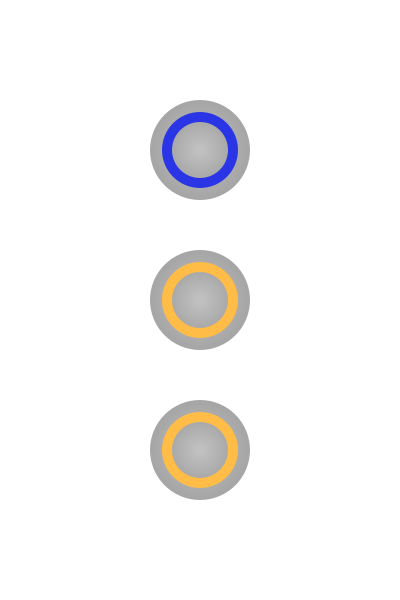
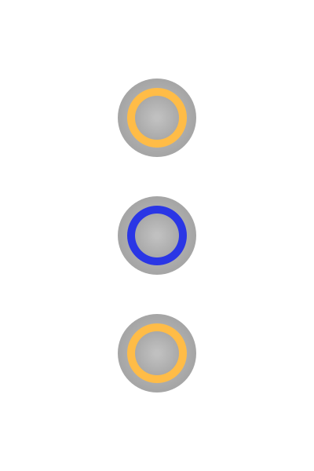

# Best Practices

You're creating a lighting control system unfamiliar to most people.  You, and other frequent users of the system, will quickly learn what each button does -- just like you have learned what traditional lightswitch does in a typical home.  

However, guests and future occupants cannot rely on years of experience using a traditional light switch to use FireFly.  Some will be intimidated, or afraid they might break something if they push the wrong button.  This guide will help you plan your systems' design in a way that creates a consistent user experience.

## Teach your Guests

When you have new guests, or even infrequent guests, you should teach them about what the different buttons do and their choice of placement.  The amount of time you spend teaching a guest should be comparable to the amount of time they will spend using the system.  For example, someone stopping by for a few hours at a cocktail party probably only needs to know how to use the controls in the bathroom, whereas an overnight guest may have multiple rooms and various buttons they have to interact with.  Age and being unfamiliar with technology can be barriers you need to be prepared to address; As soon as they understand the logic behind the system they won't be intimidated.

Buttons which handle variable lights should always be placed vertically adjacent to one another.  When using the yellow buttons placed one on top of another, it becomes easy to think of those buttons as a pair.  Press the top button and the light becomes brighter.  Press the lower button and the light becomes more dim.  It's just like the sun going up and the sun going down.  If you want it to be brighter, the sun needs to go up, so you press the upper button.  If you want it darker, press the lower button and the sun will go down.  Using this analogy with guests will greatly improve their understanding of how to use the system.

## Make Guest Areas Simple

Whenever possible, use as few buttons in as simple of a layout as possible in areas that will be frequented by guests, such as an entryway bathroom or guest bedroom.  Eliminating unnecessary "scenes" will lessen the burden on your guests to remember what you may have told them hours prior, or in the middle of the night when they are half asleep and stumbling around.

## Do No Harm

Show guests they can't harm anything by interacting with the system.  If you push the wrong button, press it again -- it will probably be just like if you turn on the wrong traditional lightswitch.

Humans will almost always go top-down or left-to-right when presented with choices.  **Particularly around stairways or other areas that could be unsafe if ventured into when dark, always ensure the top-most button lights the area.**  Your system should be designed to ensure safety above all else.

## Use Colored Buttons Consistently

Use consistent button colors to further aid in the meaning of a button.  Short and Long presses can make a button more useful, but shouldn't confuse the user.

| Color | Use | Long Press Recommended | User Expectation | 
| ----- | ----| ------- | ------| 
| Blue | Lighting | No | A light will turn on or off when pressing this button |
| Green | Exhaust Fan | No | An exhaust fan will turn on or off when pressing this button |
| Red | Security | Optional | Pushing this button will arm an alarm panel or set the alarm panel to panic mode |
| White | Special | Optional | This button will perform a special function that isn't related to any other color.  It should be reserved for setting scenes or doing other functions that don't fit within the other color expectations. |
| Yellow | Variable Light or Variable Fan | Always | Pressing this button will increase or decrease the brightness of a light, or increase or decrease the speed of a fan.  When performing a long press, the light should either go to maximum brightness or to off. |

## Use a Consistent Button Layout

- As stated above, buttons which handle variable lights should always be placed vertically adjacent to one another
- The primary control in an area should be in the top-left-most position (or top-most, if only one column)

:white_check_mark: Use this design:

- The blue button must control the primary light in the room, which is why it is at the top
- The yellow buttons are together, and can be identified by the user as a "group"
- If the dimming light was the primary light in the room, the blue button could be placed on the bottom in a yellow-yellow-blue configuration top-to-bottom.

:no_entry: Avoid this design:

- The yellow buttons are separated and therefore confusing, and because it is the top-most button, it must be the primary light
- The blue button's use is unknown because it separates the dimming buttons

## Consider Using Automation Instead of Buttons

If you're coming from a traditionally-wired home, you may think that a similar switch layout is required.  However, because your lighting controls can easily be automated by events like sunrise, sunset, and alarm panel state changes, touching a lightswith may be less necessary in the future.  FireFly is a beautiful system, but it can quickly overwhelm both you and your guests with buttons nobody knows what they do.  Be a minimalist and only place a Client or add a button to that client when it is necessary for safety, has a high probability of use, or is required by law.
