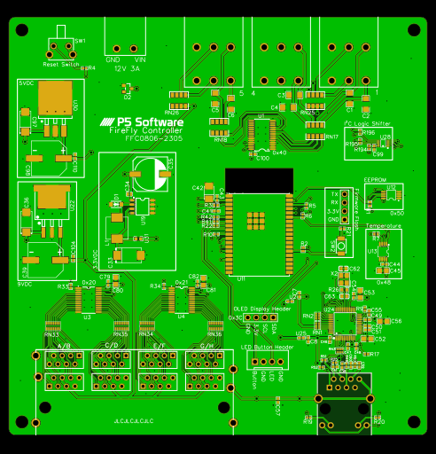
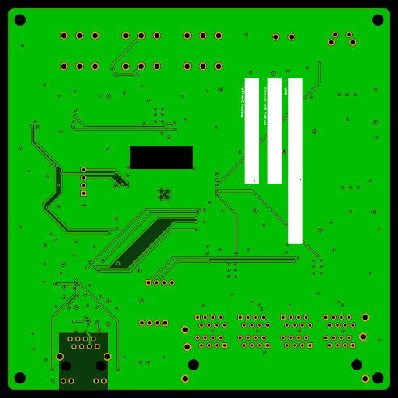

# FFC0806-2305

## Description
This controller model was a test bed for software development and manufacturing.

**Status:** Unreleased

**Hex:** 0x08062305

**Number of Inputs:** 8

**Number of Outputs:** 6

**Power Input**
- Minimum: 10.5VDC
- Recommended: 12VDC 3A
- Maximum: 26VDC

**Form Factor:** Desktop

## MCU
Espressif Systems ESP32-WROVER-E-N16R8 with 16MB Flash Storage

## I2C Addresses

| Address | Usage | Notes |
| ------- | ----- | ----- |
| 0x20    | Input Ports 1-4 | |
| 0x21    | Input Ports 5-8 | |
| 0x40    | Output Ports 1-6 | |
| 0x70    | Output All-Call | Not used |
| 0x48    | Temperature Sensor | |
| 0x50    | External EEPROM | |
| 0x3C    | OLED Display | Variable, check display configuration |

## Inputs

- 1 bank of 8-RJ45 connectors without LEDs
- 9VDC output (one per bank of 8-RJ45 connectors) to pins 4 & 5

## Outputs

- 3 double-stack 90 degree 5.08mm pluggable terminal block
- 9VDC output pins 3 & 4

## Network

Network connectivity is via Ethernet using a W5500 chipset featuring an RJ45 connector with status LEDs.  Interrupt was not yet implemented.

## Bill of Materials
Prices are each, USD, exclusive of tax/tariff, or assembly prices.

| Use                               | Manufacturer          | Manufacturer Model        | Supplier          | Supplier Part Number              | Purchase Price    | Notes |
| ---                               | ------------          | -----                     | --------          | --------------------              | --------------    | ----- |
| Master Control Unit               | Espressif Systems     | ESP32-WROVER-E-N16R8      | DigiKey           | 1965-ESP32-WROVER-E-N16R8DKR-ND   | 3.90              | 16MB |
| External EEPROM                   | Microchip Technology  | 24LC024-I/MS              | DigiKey           | 24LC024-I/MS-ND                   | 0.42              | 2KB |
| Ethernet Controller               | WIZNET                | W5500                     | LCSC/JLCPCB       | C32843                            |                   | |
| Ethernet Port                     | HANRUN                | HR911105A                 | LCSC/JLCPCB       | C12074                            |                   | |
| 25MHz Crystal                     | YXC                   | X322525MRB4SI             | LCSC/JLCPCB       | C70593                            |                   | |
| Temperature Sensor                | NXP Semiconductors    | PCT2075DP,118             | LCSC/JLCPCB       | C192518                           |                   | |
| Input Ports                       | CONNFLY Elec          | DS1131-S80BP              | LCSC              | C77853                            | 2.6982            | |
| Input Controller                  | NXP Semiconductors    | PCA9555PW,118             | LCSC/JLCPCB       | C128392                           |                   | |
| OLED Display                      | Feiyang               | 0.91" 128x32 White        | AliExpress        | 2251832485919024                  | 1.595             | Based on Vishay OLED-128O032D-LPP3N00000 |
| Power Input Port                  | Ningbo Kangnex Elec   | WJ2EDGRC-5.08-2P          | LCSC              | C3697                             | 0.027197          | |
| Power Input Plug                  | Ningbo Kangnex Elec   | WJ2EDGK-5.08-2P           | LCSC              | C71370                            | 0.107783          | |
| Output Ports                      | Cixi Kefa Elec        | KF2EDGRH-5.08-2*3P        | LCSC              | C577721                           | 0.2658            | |
| Output Plugs                      | Cixi Kefa Elec        | HT508K-5.08-3P            | LCSC              | C577811                           | 0.0898            | Low-profile |
| Output Controller                 | NXP Semiconductors    | PCA9685PW,118             | LCSC/JLCPCB       | C2678753                          |                   | |
| I2C Logic Shifter                 | Texas Instruments     | LSF0102DCUR               | LCSC/JLCPCB       | C964636                           |                   | |
| Reset Switch                      | C&K                   | PTS645VL832LFS            | LCSC              | C285525                           | 0.090682          | |
| Firmware Flash Button             | XUNPU                 | TS-1088-AR02016           | LCSC/JLCPCB       | C720477                           |                   | |
| Front Panel Button Header         | JST                   | B4B-XH-A(LF)(SN)          | LCSC              | C144395                           | 0.055267          | |
| Power Supply: 3.3VDC              | XLSEMI                | XL1509-3.3E1              | LCSC/JLCPCB       | C74193                            |                   | |
| Power Supply: 5VDC                | HGSEMI                | LM2940S-5.0/TR            | LCSC/JLCPCB       | C434496                           |                   | |
| Power Supply: 9VDC                | Texas Instruments     | LM2940S-9.0/NOPB          | LCSC/JLCPCB       | C134005                           |                   | |

## Reference Designs
None/Unreleased

## 3D Printed Parts
None/Unreleased

## Known Issues and Defects

The following are known issues (and in some cases their improvements) with this hardware.
- Ethernet interrupt pin not implemented.  A temporary surface-mount jumper was implemented to MCU pin 19.
