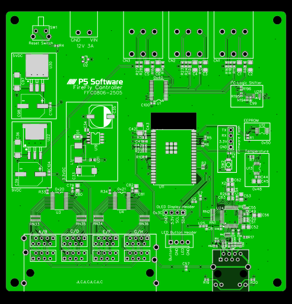
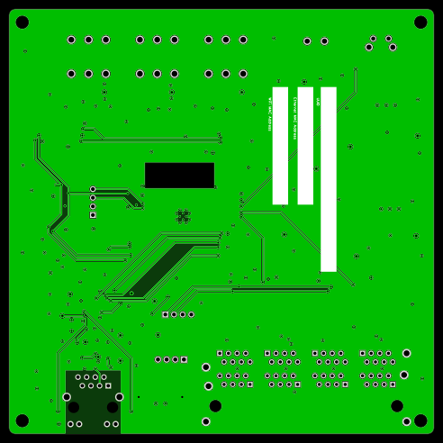

# FFC0806-2505

## Description
Final product design, featuring a desktop footprint with 8 inputs and 6 outputs.  All hardware is functional and has been fully integrated in software.

**Status:** Ready for production

**Hex:** 0x08062505

**Number of Inputs:** 8

**Number of Outputs:** 6

**Form Factor:** Desktop

## Power Input
- Minimum: 10.5VDC
- Recommended: 12VDC 3A
- Maximum: 26VDC

## MCU
Espressif Systems ESP32-WROVER-E-N16R8 with 16MB Flash Storage

## I2C Addresses

| Address | Usage | Notes |
| ------- | ----- | ----- |
| 0x20    | Input Ports 1-4 | |
| 0x21    | Input Ports 5-8 | |
| 0x40    | Output Ports 1-6 | |
| 0x70    | Output All-Call | Not used |
| 0x48    | Temperature Sensor | |
| 0x50    | External EEPROM | |
| 0x3C    | OLED Display | Variable, check display configuration |

## Inputs

- 1 bank of 8-RJ45 connectors without LEDs
- Odd-numbered ports are on the top; even-numbered ports are on the bottom

| Pin | Wire Color | Usage |
| --- | ---------- | ----- |
| 1 | White/Orange | Channel 1 |
| 2 | Orange | Channel 2 |
| 3 | White/Green | Channel 3 |
| 4 | Blue | +9VDC |
| 5 | White/Blue | +9VDC |
| 6 | Green | Channel 4 |
| 7 | White/Brown | Ground |
| 8 | Brown | Ground |

## Outputs

- 3 double-stack 90 degree 5.08mm pluggable terminal block
- Odd-numbered ports are on the top; even-numbered ports are on the bottom

| Pin | Wire Color | Meaning |
| --- | ---------- | ------- |
| V   | Red | Variable (0-5VDC) |
| + | Green | Constant (9VDC) |
| - | Black | Ground |

## Network

Network connectivity is via Ethernet using a W5500 chipset featuring an RJ45 connector with status LEDs.

## Bill of Materials
Datasheets are availalble on the [components](../components.md) page.

Prices are each, USD, exclusive of tax/tariff, or assembly prices.

| Use                               | Manufacturer          | Manufacturer Model        | Supplier          | Supplier Part Number              | Purchase Price    | Notes |
| ---                               | ------------          | -----                     | --------          | --------------------              | --------------    | ----- |
| To be populated when released to production |

## Reference Designs
[Schematic](https://raw.githubusercontent.com/BrentIO/FireFly/main/controller/hardware/FFC0806_2505/Schematic.pdf)

[EasyEDA Project](https://raw.githubusercontent.com/BrentIO/FireFly/main/controller/hardware/FFC0806_2505/EasyEDA.zip)

[Gerber Files](https://raw.githubusercontent.com/BrentIO/FireFly/main/controller/hardware/FFC0806_2505/Gerber.zip)

[BOM](https://raw.githubusercontent.com/BrentIO/FireFly/main/controller/hardware/FFC0806_2505/BOM.csv)

[Pick and Place](https://raw.githubusercontent.com/BrentIO/FireFly/main/controller/hardware/FFC0806_2505/PickAndPlace.csv)

## 3D Printed Parts
TBD

## ⚠️ Known Issues and Defects

The following are known issues (and in some cases their improvements) with this hardware.
- TBD