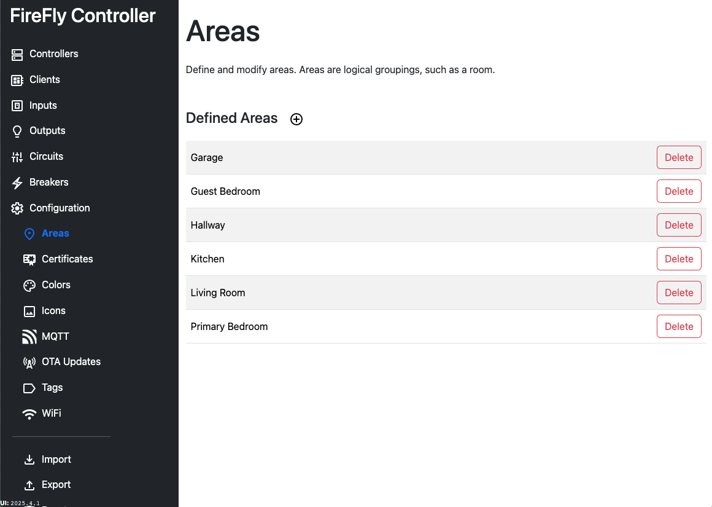

# Configuration: Areas

Areas are used by Home Assistant to logically group items together that are in the same geographic area.  When the Controller starts and Auto Discovery is triggered, the circuit's area will be sent, allowing for fast configuration of your home in Home Assistant.

Several areas come pre-defined in the database, and you may add as many as you need.

