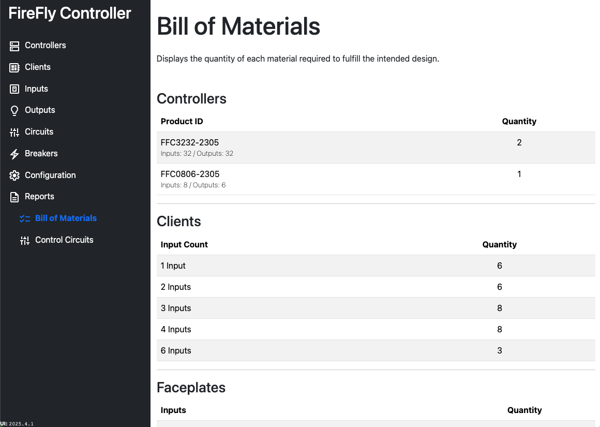

# Reports: Bill of Materials

The Bill of Materials report will display all of the hardware needed to fulfill the system design, including the product ID of the Controllers, number of each client, types of faceplates, quantity and color of each button or switch, and the number of relays by type.

