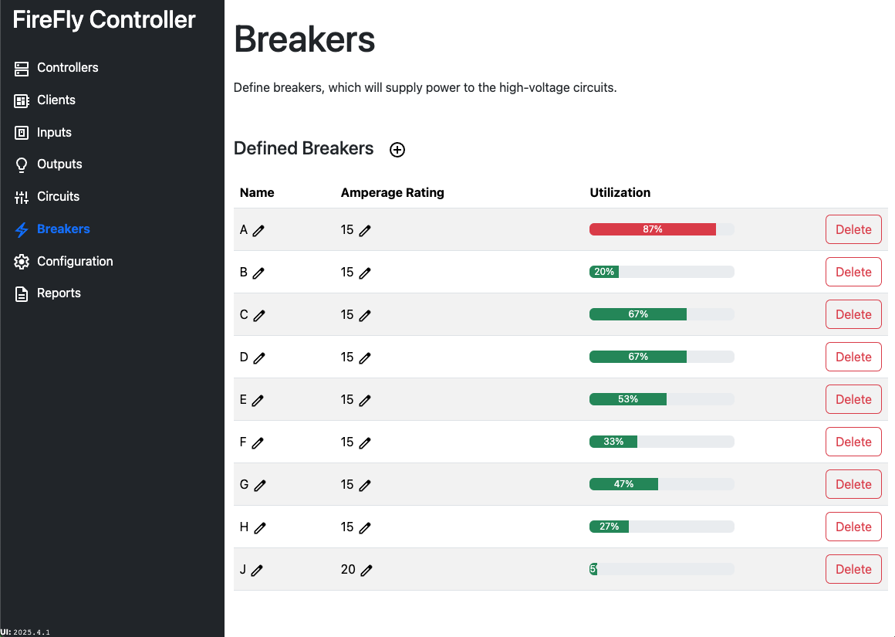

# Breakers

Breakers are one of the first items that must be configured.  Even if you aren't exactly sure the final number or amperage rating, at least one breaker must be added in order to add a circuit.

The breaker's name, maximum amperage, and its utilization will be displayed.

The same rules of thumb used for traditional controls should apply to a FireFly system.

:::info Plan less than 80% utilization
Breakers should not have a utilization over 80% for safety reasons.  If you notice more than 80% utilization, you should redesign your panel to shift some of the load to another breaker.
:::

