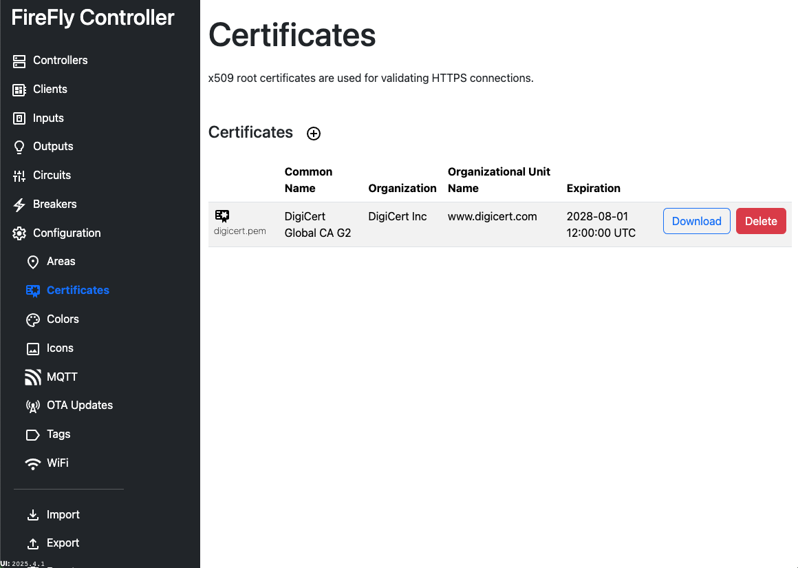

# Configuration: Certificates

Certificates are required when the OTA server uses HTTPS.  Multiple certificates can be uploaded, however, only one certificate can be configured to be used for OTA.  Forced OTA updates can specify a different certificate if necessary.

See more information about [certificate management](/controller/support/certificate_management).

