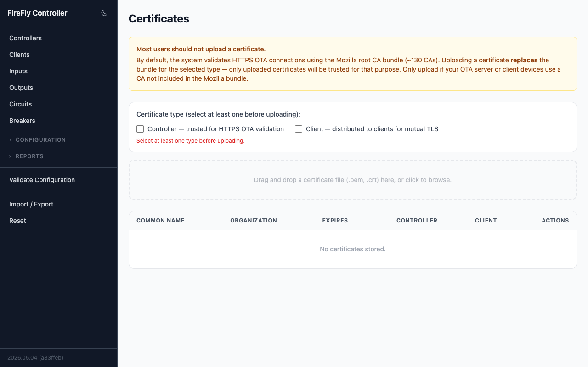

# Configuration: Certificates

Use this page to upload root CA certificates for HTTPS OTA validation.  Uploading one or more certificates here causes those certificates to be used exclusively for OTA validation instead of the built-in bundle.

See [Certificate Management](/controller/support/certificate_management) for a full explanation of how the certificate bundle works and instructions for obtaining a root CA.

