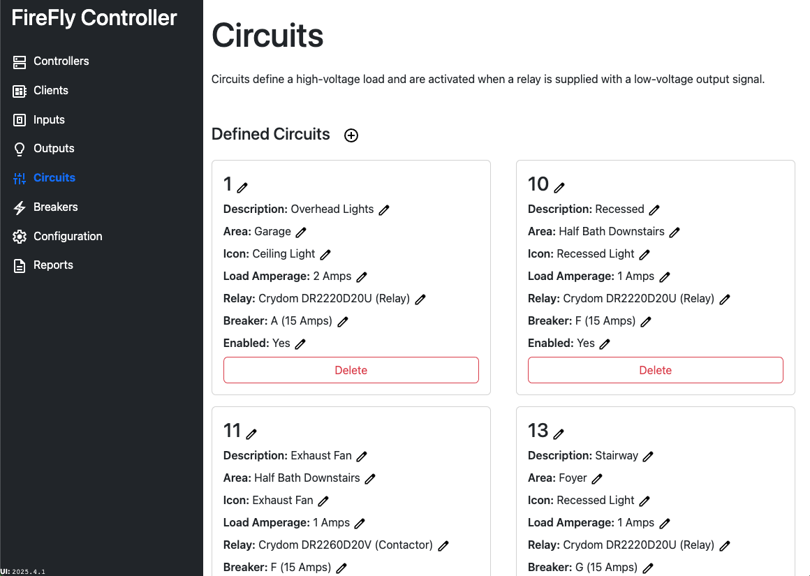
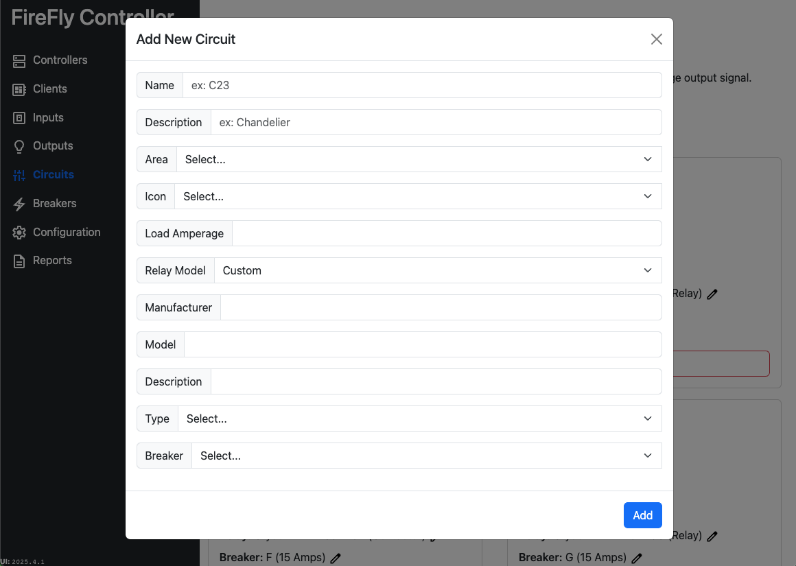

# Circuits

Circuits are controlled by a high-voltage relay.  A circuit is attached to a single breaker, and the total maximum amperage draw should be estimated for the circuit.  If the circuit is marked as `Enabled: No`, the circuit will not be switched by the Controller.

An ID can be set for the circuit, as well as a short description, [area](./areas.md), and [icon](./icons.md).

## Custom Relay Models

There relay models discussed in the [High Voltage Relays section](/controller/hardware/relays.md) have been pre-populated in the database and cannot be removed.  However, you can optionally add your own if using a different manufacturer or model.  To add a new relay model, simply select `Custom` from the drop-down.  Once you add the circuit, the relay model will be available to add in the drop-down with any additional new circuits.

When no circuits remain with the custom model, it will be deleted.

