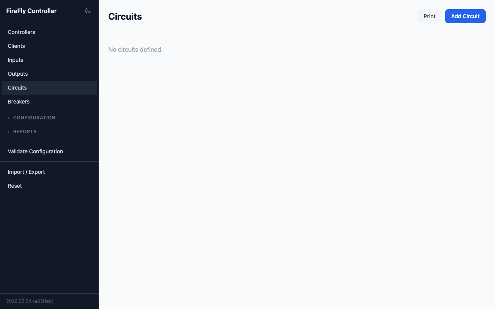
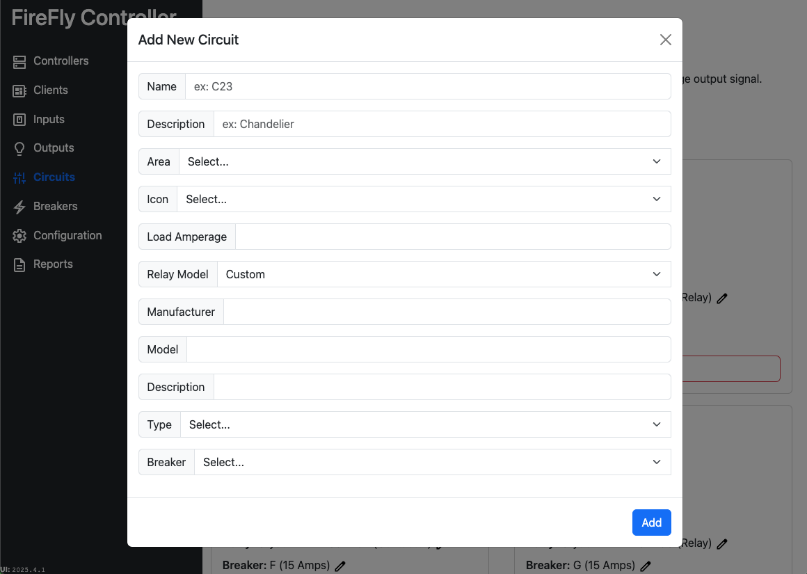

# Circuits

Circuits are controlled by a high-voltage relay.  A circuit is attached to a single breaker, and the total maximum amperage draw should be estimated for the circuit.  If the circuit is marked as `Enabled: No`, the circuit will not be switched by the Controller.

An ID can be set for the circuit, as well as a short description, [area](./areas.md), and [icon](./icons.md).

## Variable Outputs and Start Brightness

Circuits assigned a proportional (VARIABLE) relay model support dimming from 0–100%.  When a button configured with a [TOGGLE action](./controllers.md) turns a VARIABLE output on from an off state, it uses the circuit's **Start Brightness** value rather than switching directly to full brightness.

| Property | Value |
| -------- | ----- |
| Default | 10% |
| Valid range | 5–100% |
| Applies to | TOGGLE button actions only |

The Start Brightness field is only shown in the circuit editor when a VARIABLE relay model is selected.  For BINARY relay models the field is hidden and has no effect.

> [!NOTE]
> Start Brightness only affects button TOGGLE actions.  MQTT commands always set the output to the exact brightness value specified, regardless of this setting.  For example, sending `17` over MQTT to an output that is currently off will set it to 17% brightness.

> [!WARNING]
> The firmware enforces a minimum brightness threshold of 5%.  Any value below 5% is treated as 0% (off).  Setting Start Brightness to a value below 5% will cause a TOGGLE action to turn the output off immediately rather than on.

## Custom Relay Models

There relay models discussed in the [High Voltage Relays section](/controller/hardware/relays.md) have been pre-populated in the database and cannot be removed.  However, you can optionally add your own if using a different manufacturer or model.  To add a new relay model, simply select `Custom` from the drop-down.  Once you add the circuit, the relay model will be available to add in the drop-down with any additional new circuits.

When no circuits remain with the custom model, it will be deleted.

