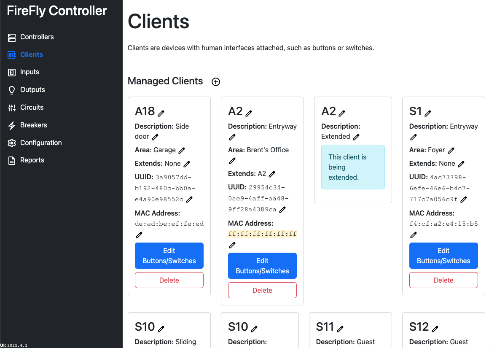
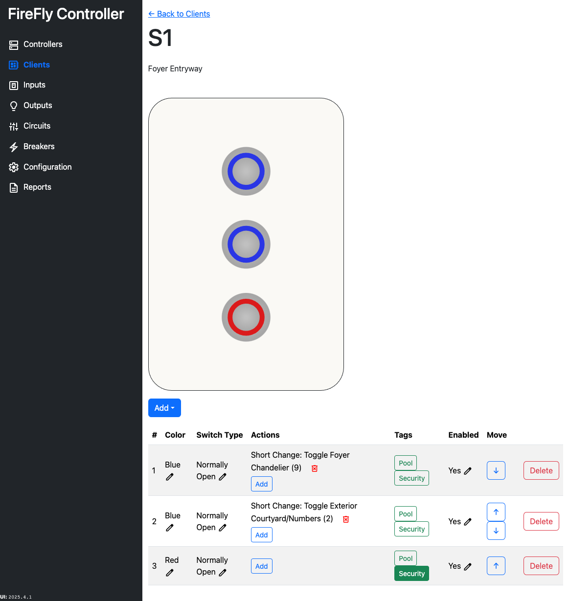

# Clients

Clients are devices with human interfaces attached, such as buttons or switches.

An ID can be set for the client, as well as a short description and [area](./areas.md).  A MAC address must also be assigned, though one can be generated on a temporary basis until the actual MAC address is known.  When a MAC address has been generated, `ff:ff:ff:ff:ff:ff` will be used and will be highlighted on the configuration page.

## Extended Clients

Each client can support up to four buttons or switches, however, two client entries can be joined together to support a total of six buttons or switches.

When a client is extended, the primary client uses all four channels.  The secondary uses two of the four channels.

| Client | Physical Channel | Logical Channel |
| ------ | ---------------- | --------------- |
| Primary | 1 | 1 |
| Primary | 2 | 2 |
| Primary | 3 | 3 |
| Primary | 4 | 4 |
| Extended | 1 | 5 |
| Extended | 2 | 6 |

Extended clients should be named identically as their primary client.  When the client is being extended, a notification will be shown on the client as additional attributes (name, location, MAC address, etc) are ignored on extended clients.

## Button and Switch Assignments

A client which has not been extended can have up to four buttons or switches.  If a client has been extended, it may have up to six buttons or switches.

When clicking `Add`, select the type of interface desired.  Most buttons are `Normally Open`.  Switches can be either Normally Open or Normally Closed, depending on the switch type.  You cannot change a button to a switch or a switch to a button.  If you add one by mistake, you will need to delete it and re-add it.

A button or switch can have multiple actions, though it is a good rule of thumb not to have more than two actions for each change.  For example, you may want to have a button that toggles the patio lights and the front street light (two separate circuits).  If the user does a long press, it may also toggle the sconces.

Each button or switch can also be assigned one or more [tags](./tags.md).  In the example below, the red button has been assigned the `Security` tag.  In the example below, no other buttons have a tag assigned to them.

If a button or switch is marked as `Enabled: No`, the input will not be monitored by the Controller and it will do absolutely nothing.

You can move button and switches up and down to arrange them as desired.  When you have exactly 5 buttons, you can also choose to invert the faceplate so that you have the odd button at the top or at the bottom.

If you hover over the button or switch, you will see a list of actions that will be performed when a change is observed.  This is helpful to think through your user experience.

### Short Press versus Long Press Actions

When both a long press and a short press action is defined, the short press action **will always be triggered before the long press**.  A great use for long press events are with dimmable lights.  A short press event may increase the brightness by one step (appoximately 10%).  A long press could increase the brightness to 100%.  If the light was off and the user presses and holds the button only once, the light will go from 0% to 10% briefly, then to 100%.