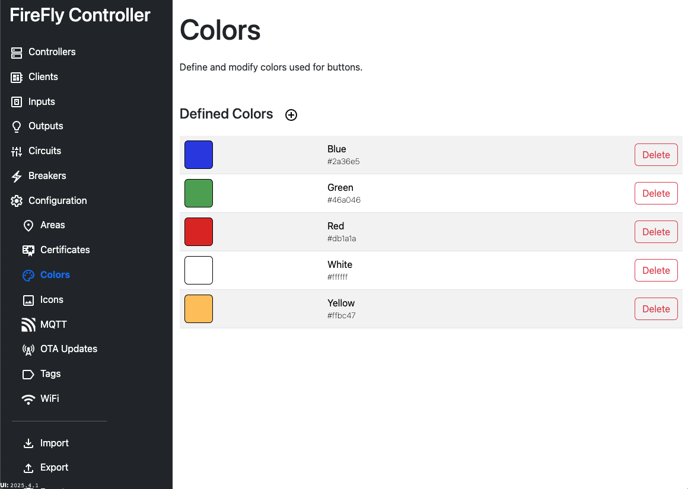

# Configuration: Colors

Colors are used by buttons.  To improve the user experience, different color buttons should be used to indicate different expected uses.  This is helpful for guests and others who may be unfamiliar with your setup.  You should use a consistent color and button placement when designing your system.

See our [Best Practices](/best_practices) guide for more detail on how to use colors to improve your systems' usability.

