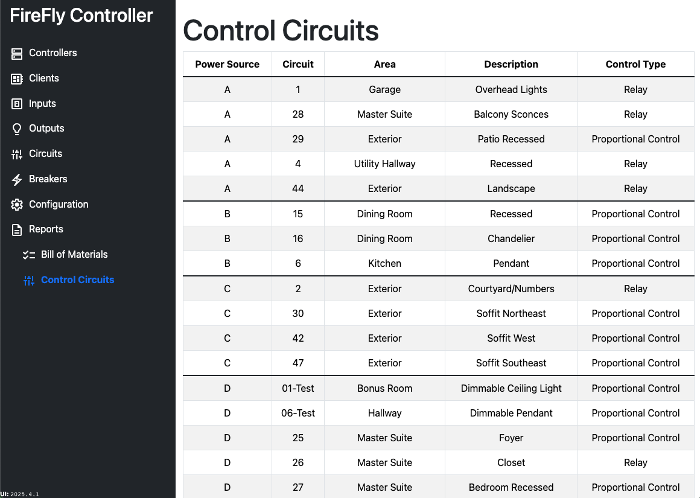

# Reports: Control Circuits

The Control Circuits report is designed to be printed and placed adjacent to the relay panel.  This will assist in troubleshooting issues.  

Because it identifies the individual circuits and their power sources, it is usually required by local in the United States.

