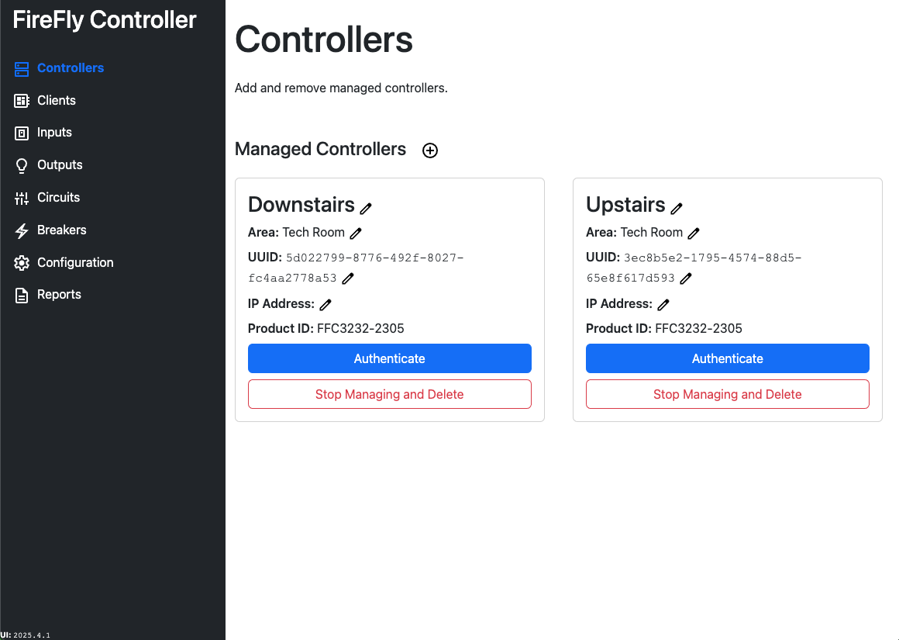
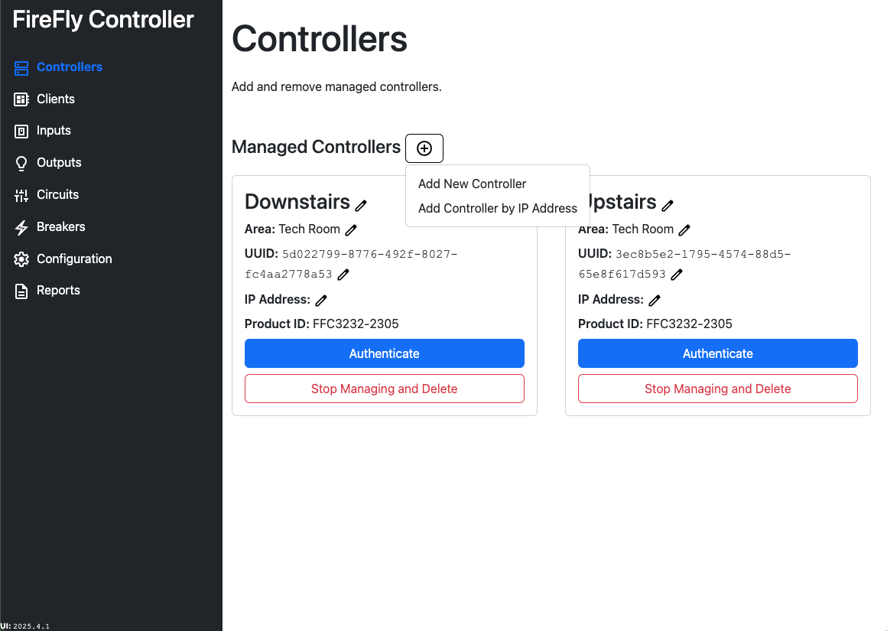
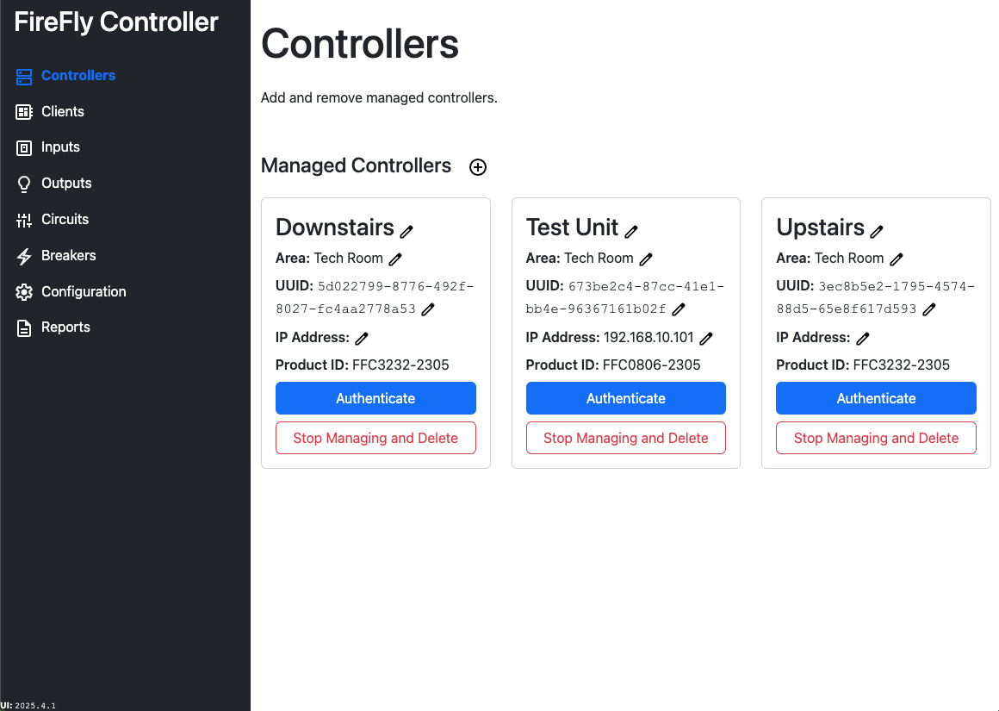
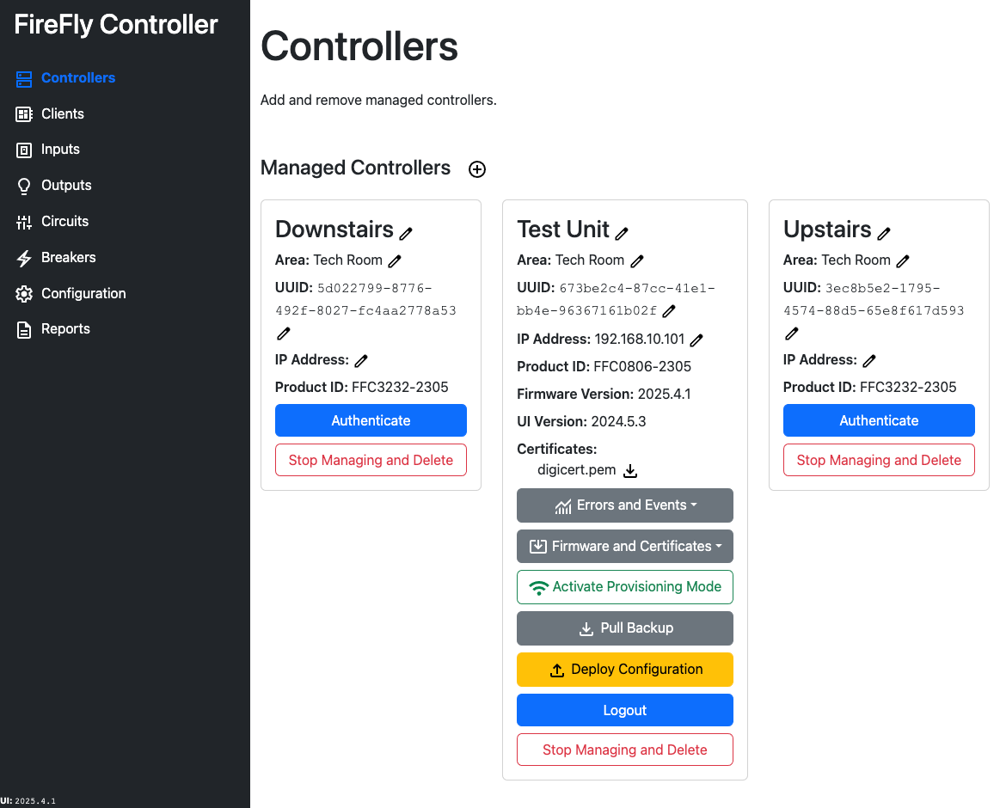

# Controllers

Controllers can be added even when all of their details are not yet known.  An existing Controller can also be added by IP address, which will add the Controller and download basic information about it to the configuration UI.

:::info Controllers don't add themselves
Although you might be using the configuration UI from a Controller, that Controller may not be shown because data is stored in your browser.  You will still need to add the Controller manually or by IP address.
:::

To add a controller, you can type the information manually, or you can add it by IP address.  When adding by IP address, a visual token will also be required.

After a controller is added, you will need to authenticate if you want to take any actions on it.  Doing so will require a visual token.  After authentication, multiple options will be displayed.  Note that some information is only collected from the Controller at its most recent authentication.  Forcing an update to occur may render some information stale, though a logout and re-authentication will update the data to the most recent values.  It may be necessary to update the IP address of the device to re-authenticate.

## Errors and Events
Through the configuration UI, you can view the full list of errors and events that have been displayed on the OLED display.  However, through the configuration UI, up to twenty prior events can be displayed, unlike the UI which can only display the last four errors and events. (The maximum number of errors and events retained can be modified at compile time by changing the `EVENT_LOG_MAXIMUM_ENTRIES` definition).

## Firmware and Certificates

### Push Certificates 

Certificates that have been added in the configuration UI can be pushed to the Controller immediately without making any other changes.  This is useful when a forced update is necessary, and the required certificate is not installed on the Controller.  

:::danger Existing certificates will be deleted from the Controller
Existing certificates on the Controller will be deleted when certificates are pushed.  You should download the certificates from the Controller or pull a backup from the Controller prior to pushing certificates to avoid the loss of a needed certificate.
:::

### Force Updates

Updates can be forced to the Controller for either the Application or SPIFFs.  Although this should be a safe operation to perform, you should pull a backup from the Controller prior to forcing an update.

Application updates will always require a reboot after being deployed.  Keep this in mind as there will be an interruption to lighting when the update is being deployed and all outputs will be set to "off" during the reboot.

## Activate Provisioning Mode

Clicking the Activate Provisioning Mode button will toggle [Provisioning Mode](/controller/software/controller/provisioning_mode.md).  This is an asynchronous request and will take several seconds for the radio to turn on and the client information to be loaded into memory.  Refer to the OLED display to know when Provisioning Mode has become activated.

## Pull Backup

Pulling a backup from the Controller retrieves the database backup that was previously written during the last deployment.  This is a non-destructive action, and the backup file will be downloaded to your device.  The backup contains all information, and should be identical on all controllers if they were previously deployed simultaneously.

::: danger Unencrypted secret information is contained in the file
All information configured about FireFly is contained in this file and the data is **unencrypted**.  Device information, MQTT credentials, and WiFi credentials are stored **unencrypted**.  

*Never post the export to a public forum*.
:::

To use the backup, follow the instructions on [Importing a Configuration](./import.md).  

## Deploy Configuration

Deploying a configuration to a Controller is usually the last step in the process.  Doing so writes all necessary information to the Controller including:
- Certificates
- Configuration for each Controller and Client defined in the database
- MQTT, WiFi, and OTA settings
- Backup of the current database to the device

Depending on the number of devices in the estate, a deployment may take from several seconds to a couple of minutes.  Provisioning Mode does not need to be active to deploy a configuration. 

## Logout

Logging out is not usually necessary, as the visual token will continue to expire after approximately 30 minutes.  The configuration UI will automatically log out after approximately 30 minutes as well.  However, if changes have been made to the Controller and they are not reflected in the UI, you may want to log out and re-authenticate to see the latest changes.

## Stop Managing and Delete

A controller can be deleted if nothing has been assigned to it, including inputs and outputs.  If any inputs or outputs are assigned, you will not be able to stop managing and delete the Controller until they have been unassigned from the Controller.