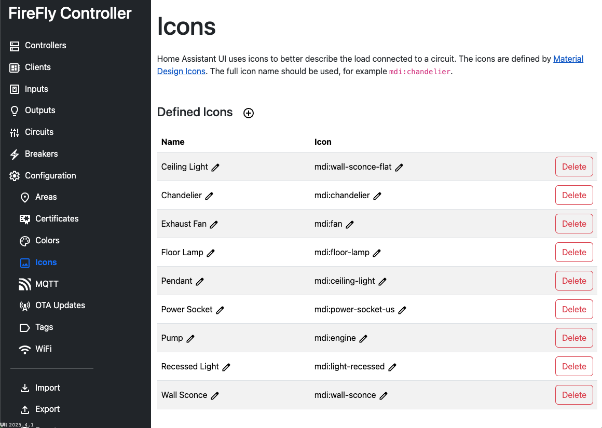

# Configuration: Icons

Home Assistant UI uses icons to better describe the load connected to a circuit. The icons are defined by [Material Design Icons](https://pictogrammers.com/library/mdi/), though any icon that is known to Home Assistant can be defined. The full icon name should be used, for example `mdi:chandelier`.

Because icons are ever-changing and require significant amounts of space to be available offline, the icon will _not_ be shown in the Configuration UI.  It will be passed to Home Assistant for display, however.

