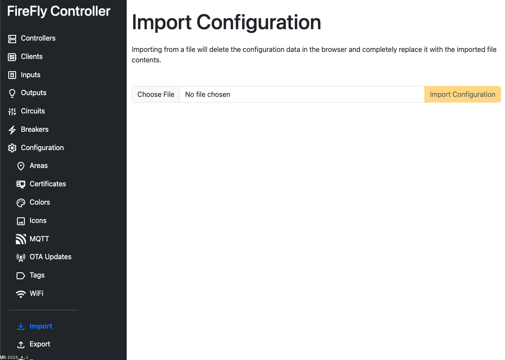

# Configuration: Import

Configurations can be imported after being exported.  This is helpful to back up configurations to the cloud or your computer in the event changes are needed in the future or a hardware failure occurs.

Each Controller contains a backup of the database at the `/backup` endpoint.  It can be retrieved by calling a `GET` command to the Controller's endpoint.  For more information, see the [API Documentation](/controller/software/controller/api_reference).

::: danger This is a destructive action
Once imported, any prior configuration changes are lost forever.
:::

::: danger Unencrypted secret information is contained in the file
All information configured about FireFly is contained in this file and the data is **unencrypted**.  Device information, MQTT credentials, and WiFi credentials are stored **unencrypted**.  

*Never post the export to a public forum*.
:::

The file uses the [Dexie.js](https://dexie.org/docs/ExportImport/dexie-export-import) database format.

