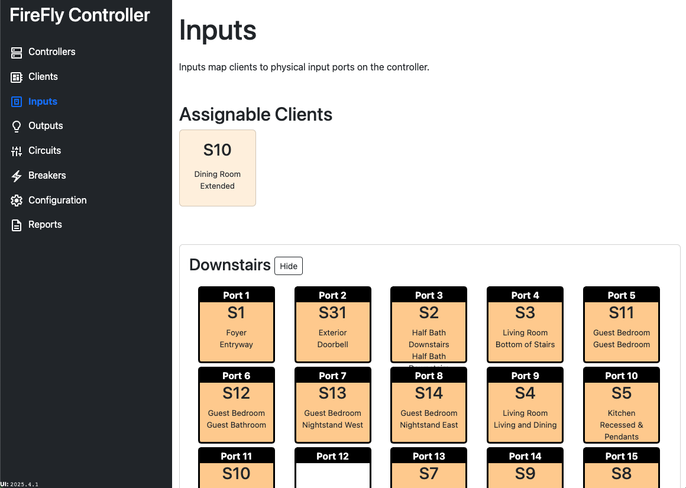

# Inputs

Inputs map clients to physical input ports on a Controller.  At least one Controller must be added before you can assign a Client to it.

To assign a Client to a controller port, simply drag-and-drop.  To unassign a Client, simply drag the Client off the assignment and an `Unassign` box will appear at the top of the window.

:::info This feature is not supported on Android
Drag-and-drop functionality is not supported on Android.
:::

## Extended Clients
Extended Clients are clients that have more than four physical inputs.  Extended Clients are denoted on the Inputs page with a lighter color.

A single client has two RJ45 ports on the Client end and requires two RJ45 ports on the Controller end.  When a Client is being extended, both the primary Client and the Extended Client must be assigned to the same Controller.  Whever possible, both the primary and Extended Client should be placed adjacent to each other, with the primary being assigned to an odd-numbered port and the Extended Client assigned to an even-numbered port.  This should ensure that they are connected to the same power supply.

Additional information about Extended Clients can be found on the [Clients](./clients.md) page. 

