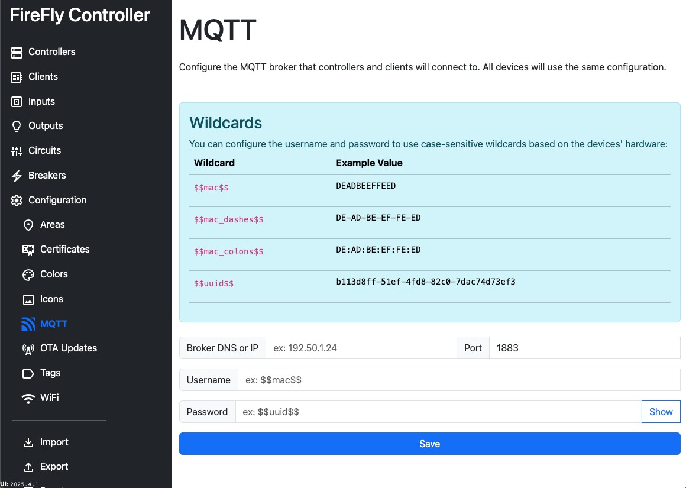

# Configuration: MQTT

MQTT is the mechanism that FireFly communicates to both Home Assistant and FireFly Clients.

The MQTT broker's DNS and IP can be defined, as well as a port.  If you do not specify a port, `1883` will be used as it is the default MQTT port.

When determining how to configure your username and passwords for devices, you have two options: use the same username and password to connect to MQTT for all devices -- OR -- use a known mechanism to have a different username and password for each device, based on its hardware.  Using wildcards will improve your security through obscurity.  Both the username and password can use different wildcards, so you could have the username be `$$mac$$` and password be `$$uuid$$`.  An intruder would need to know the combination of both in order to authenticate to MQTT.

You can specify four different wildcards based on your MQTT authentication standards.  Examples are below for a device with a MAC address of `DE:AD:BE:EF:FE:ED` and a UUID of `b113d8ff-51ef-4fd8-82c0-7dac74d73ef3`:

| Wildcard | Example Value |
| -------- | ------------- |
| `$$mac$$` | `DEADBEEFFEED` |
| `$$mac_dashes$$` | `DE-AD-BE-EF-FE-ED` |
| `$$mac_colons$$` | `DE:AD:BE:EF:FE:ED` |
| `$$uuid$$` | `b113d8ff-51ef-4fd8-82c0-7dac74d73ef3` |

::: warning Data is unencrypted
This information is never encrypted, including when stored in the configuration database, any configuration exports, at rest on the Controller, and at rest on the Client.
:::

