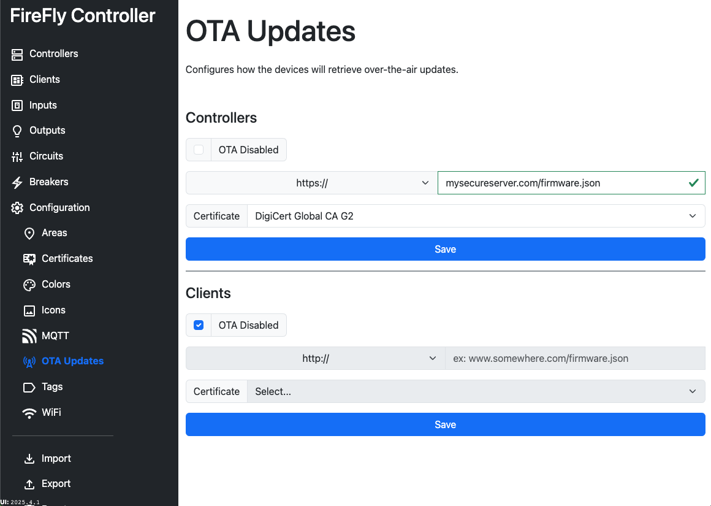

# Configuration: OTA Updates

Controllers and <Badge type="warning" text="TODO" /> Clients can have their firmware and UI updated over-the-air.  By default the device will check once per day, approximately at the time the device was booted, for new firmware.

If `OTA Disabled` is checked, no OTA configuration is sent for that device type.

If `https` is selected, you must first upload a [certificate](/controller/software/controller/configuration/certificates) in the UI before you will be able to save.  Only one certificate can be defined.  Certificates are automatically deployed when the configuration is pushed to a Controller.

You can configure the URL to include wildcards, which will be substituted at execution time.

| Wildcard | Example Value |
| -------- | ------------- |
| `$$pid$$` | `FFC3232-2305` |

::: info EEPROM Required
using `$$pid$$` requires the external EEPROM to be present and programmed.
:::

Additional information about [OTA updates](/controller/support/ota_updates) can be found on the support page.

