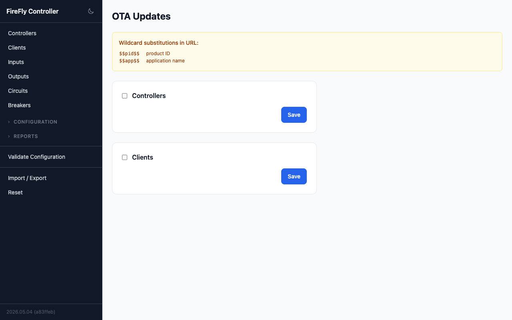

# Configuration: OTA Updates

Controllers and [Clients](/client/support/ota_updates) can have their firmware updated over-the-air.  By default the device will check once per day, approximately at the time the device was booted, for new firmware.

If `OTA Disabled` is checked, no OTA configuration is sent for that device type.

Both `http` and `https` URLs are supported.  When `https` is used, the firmware validates the server certificate using the ESP32 core's built-in Mozilla root CA bundle by default.  If you have uploaded any certificates to the device, those are used instead of the built-in bundle.  No separate certificate selection is required.

The default URL format is `https://api.fireflylx.com/ota/$$class$$/$$product_hex$$/$$application$$?current_version=$$current_version$$`.

You can configure the URL to include wildcards, which will be substituted at execution time.  The underlying library will URL encode as necessary.

| Wildcard | Example Value |
| -------- | ------------- |
| `$$mac$$` | `DEADBEEFFEED` |
| `$$mac_dashes$$` | `DE-AD-BE-EF-FE-ED` |
| `$$mac_colons$$` | `DE:AD:BE:EF:FE:ED` |
| `$$uuid$$` | `b113d8ff-51ef-4fd8-82c0-7dac74d73ef3` |
| `$$application$$` | `controller` |
| `$$class$$` | `controller` |
| `$$product_hex$$` | `0x32322505` |
| `$$current_version$$` | `2026.03.01` |

::: info Device Identity Required
Using `$$uuid$$` requires the device identity to be provisioned in eFuse.
:::

Additional information about [OTA updates](/controller/support/ota_updates) can be found on the support page.

