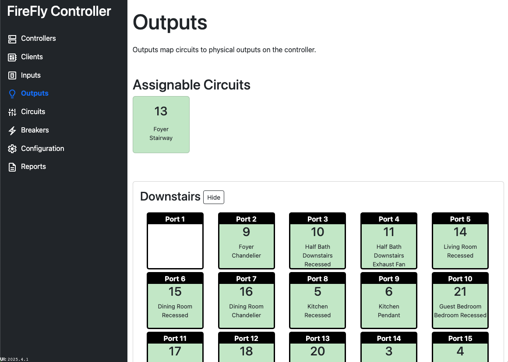

# Outputs

Outputs map circuits to physical outputs on a Controller.  At least one Controller must be added before you can assign a circuit to it.

To assign a circuit to a controller port, simply drag-and-drop.  To unassign a circuit, simply drag the circuit off the assignment and an `Unassign` box will appear at the top of the window.

:::info This feature is not supported on Android
Drag-and-drop functionality is not supported on Android.
:::

