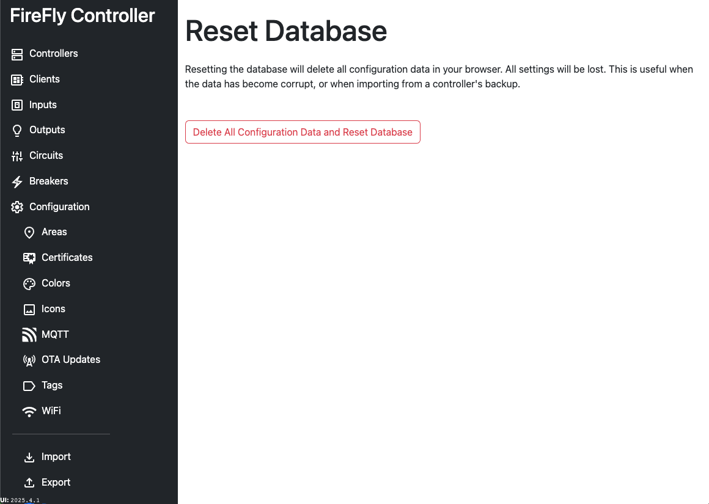

# Configuration: Reset

Resetting the database will delete all configuration data and restore the database to the defaults.  No data is retained after confirming to reset the database.

::: danger This is a destructive beahvior
Once reset, any configuration changes are lost forever.
:::

