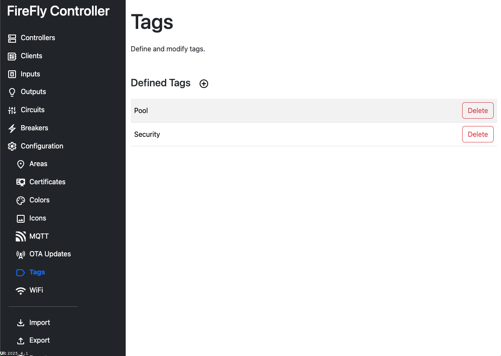

# Configuration: Tags

Tags are arbitrary descriptors that can be applied to an input channel.  FireFly Clients use tags to address groups of input LED's, such as making all buttons with a tag of `Security` blink when the alarm is arming.

Tags can be up to 20 characters in length, per the [API Documentation](/controller/software/controller/api_reference).  Multiple tags can be applied to a [button or switch](/controller/software/controller/configuration/clients).

<Badge type="warning" text="TODO" /> Documentation on the use of tags via MQTT is coming soon.

