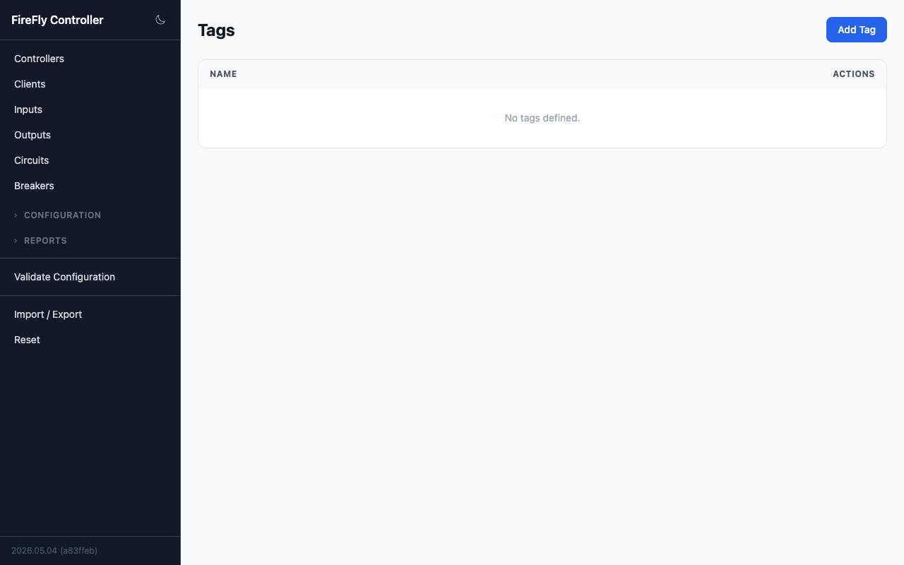

# Configuration: Tags

Tags are arbitrary descriptors that can be applied to an input channel.  FireFly Clients use tags to address groups of input LED's, such as making all buttons with a tag of `Security` blink when the alarm is arming.

Tags can be up to 20 characters in length, per the [API Documentation](/controller/software/controller/api_reference).  Up to 5 tags can be applied to a [button or switch](/controller/software/controller/configuration/clients).

[](./tags.png)


## MQTT Tag Commands

Any MQTT publisher — such as Home Assistant — can send commands to a tag topic to control the LEDs on every Client channel assigned to that tag simultaneously.  The Controller plays no active role at runtime; it assigns tags during configuration but does not publish to or subscribe from tag topics.

On every MQTT connect (and reconnect), the Client subscribes to one topic per unique tag across all of its configured HID channels:

```
FireFly/tag/{tag_name}/set
```

::: info Topic casing
Tag names in MQTT topic paths are **lowercase** regardless of how the tag was entered in the Configurator.  For example, a tag named `Security` subscribes as `firefly/tag/security/set`.
:::

### Payload

```json
{ "state": "blink", "brightness": 75 }
```

| Field | Type | Required | Description |
|---|---|---|---|
| `state` | string | Yes | Animation state to apply. See [States](#states) below. |
| `brightness` | integer (0–100) | No | LED brightness during the animation. Omit to use each channel's configured `defaultBrightness`. |

### States

All animation states run **continuously** until a subsequent command changes them.

| State | Behavior |
|---|---|
| `snore` | Smooth continuous pulse (slow fade in and out) |
| `blink` | Hard on/off at 750 ms intervals |
| `blink-rapid` | Hard on/off at 375 ms intervals |
| `normal` | Cancels any active animation; restores the LED to the channel's `defaultBrightness` |

::: info
`normal` ignores the `brightness` field.  There is no dedicated `off` state — to turn LEDs off, send `{"state":"blink","brightness":0}`.
:::

### MQTT Message Sequence

[](./images/tags_mqtt.svg)

### Full Specification

For the complete topic structure, payload schemas, and field-level documentation see the [Client MQTT Reference](/client/software/client/mqtt_reference).