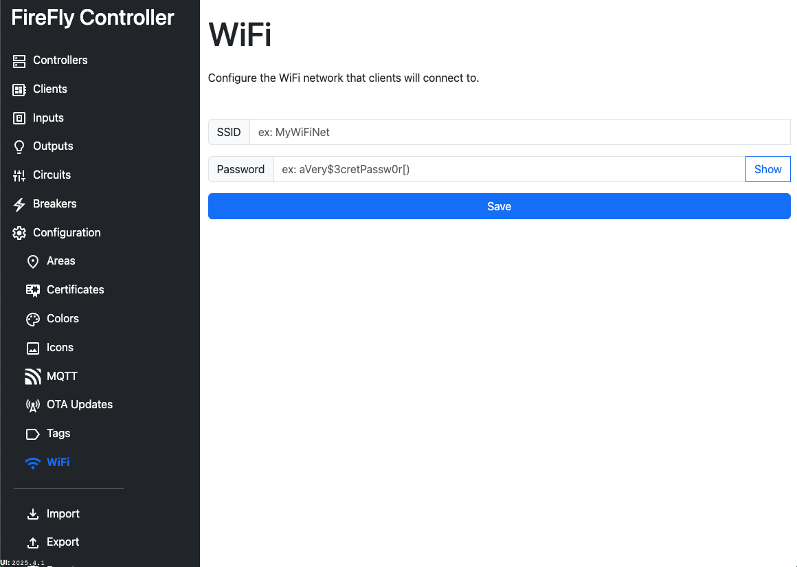

# Configuration: WiFi

Although FireFly Controllers always use Ethernet, FireFly Clients always connect to WiFi.  The WiFi configuration section is downloaded to each client during the [Provisioning Mode](/controller/software/controller/provisioning_mode/) process.

::: warning Data is unencrypted
This information is never encrypted, including when stored in the configuration database, any configuration exports, at rest on the Controller, and at rest on the Client.
:::

