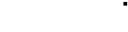

# OLED Screens
The OLED display will show current status and configuration of the controller.

OLED screens are activated by pushing the front panel button.  When cycling through the front panel, the intro screen for each topic will be shown for a short period of time before the detail is shown.

A scrollbar is show on the right side of the display indicating where the user is in the sequence flow.

## Sequence Flow

[draw.io source file](https://raw.githubusercontent.com/BrentIO/FireFly/main/controller/support/OLED_screens/sequence.drawio)

## Logo
Displays until the controller has booted.

## Event Log
Displays the four most recent events from the event log, with the newest event on the bottom of the screen.

### Intro

### Detail
There are some [abbreviations](/controller/support/abbreviations) and [failure reason codes](/controller/support/failure_reason_codes) which can be shown.

## Network
Displays the network controller information.  Which network controller type is displayed depends on the network controller being defined in `hardware.h` and support for the controller compiled into the binary.

### Intro

### WiFi Detail
WiFi detail will only be displayed if the hardware supports WiFi and it was compiled with WiFi support.

AP name is a concatenation of `FireFly-` and the last six characters of the _base_ MAC address.

The MAC address displayed is the MAC address of the _SoftAP_.

A total number of clients connected will be shown.

### Ethernet Detail
Ethernet detail will only be displayed if the hardware supports Ethernet and it was compiled with Ethernet support.

The MAC address displayed is the MAC address of the Ethernet controller.

Connection speed and duplex are displayed.

## Hardware
Displays information about the hardware, if an identity has been entered into the external EEPROM.  If it has not, a notification is displayed indicating it has not been configured.

### Intro

### Detail
The product ID (PID) from the external EEPROM is displayed, as well as the device's unique identifier (UUID).

## Software
Displays information about the software running on the controller.

### Intro

### Detail
The software application name and version are displayed.

## Errors
Displays error information, if it exists.  If there are no errors present, this section will not be displayed.  

While errors are present, the OLED will not sleep, and return to this screen after a period of inactivity.

Errors are displayed with the newest error on the bottom of the screen.

### Intro

### Detail
The software application name and version are displayed.  There are some [abbreviations](/controller/support/abbreviations) and [failure reason codes](/controller/support/failure_reason_codes) which can be shown.

## Auth Token
Displays the current authorization token active on the controller.  This is used for both security and to ensure the correct controller is being configured.  A random sequence of letters and numbers are displayed and will refresh when the countdown timer bar reaches zero.

### Intro

### Detail
The current auth token displayed with the countdown timer bar.

