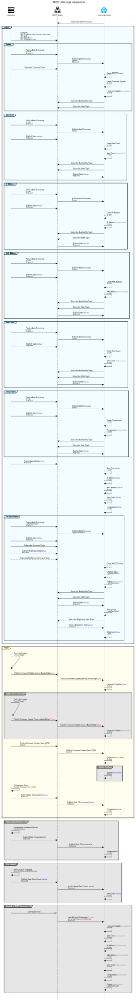

# Home Assistant Auto Discovery

The integration to Home Assistant is done via MQTT auto discovery.  The benefit of auto discovery is that no additional software needs to be configured in Home Assistant for it to work.

::: info Why aren't inputs included in auto discovery?
Home Assistant auto discovery is only provided with the output information, not input message events, like a button press.  You can [read more about automating with inputs using MQTT](./inputs).
:::


::: info What does FireFly use for the Home Assistant Auto Discovery topic?
FireFly uses the default topic root of `homeassistant` for auto discovery.  You can configure this inside the MQTT settings.  There is a maximum length of 24 for the topic root.  It should _not_ include a trailing `/`.
:::

## MQTT Message Sequences
During the `setup()` process (and eventually `loop()` process), the controller will execute the following MQTT actions after making a connection to the broker:



<details>
<summary>Diagram Source Code</summary>

Source text to create this diagram on [sequencediagram.org](https://sequencediagram.org/)

```
title MQTT Message Sequences
participantspacing equal
materialdesignicons F1C9A "Controller" as ctl
materialdesignicons F0317 "MQTT Broker" as mqtt
materialdesignicons F07D0 "Home Assistant" as ha #18bcf2


ha->mqtt: Subscribe Auto Discovery


group #c2efff setup()

    ctl->mqtt: Connect()\n--Will Topic: ""FireFly//{UUID}///availability""\nWill QoS: ""2""\nWill Retain: ""True""\nWill Message: ""offline""

    group #c2efff Update
        ctl->mqtt: Publish Auto Discovery\n--Update--\n--Retained--
        mqtt->ha: Publish Auto Discovery\n--Update--\n--Retained--
        ctl->mqtt: Subscribe Command Topic
        ha-->ha: Create MQTT Device
        ha-->ha: Create Firmware Update\n--Update--
        ha->ha: Firmware Update <color:#808080>""Unavailable""</color>\n--Update--
        ha->mqtt: Subscribe Availability Topic
        ha->mqtt: Subscribe State Topic
    end

    group #c2efff Start Time
        ctl->mqtt: Publish Auto Discovery\n--Sensor--\n--Retained--
        mqtt->ha: Publish Auto Discovery\n--Sensor--
        ctl->mqtt: Publish State: <color: #0000ff>""Value""</color>\n--Retained--
        ha-->ha: Create Start Time\n--Sensor--
        ha->ha: Start Time <color:#808080>""Unavailable""</color>\n--Sensor--
        ha->mqtt: Subscribe Availability Topic
        ha->mqtt: Subscribe State Topic
        mqtt->ha: Publish State: <color: #0000ff>""Value""</color>\n--Retained--
    end

    group #c2efff IP Address
        ctl->mqtt: Publish Auto Discovery\n--Sensor--\n--Retained--
        mqtt->ha: Publish Auto Discovery\n--Sensor--
        ctl->mqtt: Publish State: <color: #0000ff>""Value""</color>\n--Retained--
        ha-->ha: Create IP Address\n--Sensor--
        ha->ha: IP Address <color:#808080>""Unavailable""</color>\n--Sensor--
        ha->mqtt: Subscribe Availability Topic
        ha->mqtt: Subscribe State Topic
        mqtt->ha: Publish State: <color: #0000ff>""Value""</color>\n--Retained--
    end
    
    group #c2efff MAC Address
        ctl->mqtt: Publish Auto Discovery\n--Sensor--\n--Retained--
        mqtt->ha: Publish Auto Discovery\n--Sensor--
        ctl->mqtt: Publish State: <color: #0000ff>""Value""</color>\n--Retained--
        ha-->ha: Create MAC Address\n--Sensor--
        ha->ha: MAC Address <color:#808080>""Unavailable""</color>\n--Sensor--
        ha->mqtt: Subscribe Availability Topic
        ha->mqtt: Subscribe State Topic
        mqtt->ha: Publish State: <color: #0000ff>""Value""</color>\n--Retained--
    end

    group #c2efff Error Count
        ctl->mqtt: Publish Auto Discovery\n--Sensor--\n--Retained--
        mqtt->ha: Publish Auto Discovery\n--Sensor--
        ctl->mqtt: Publish State: <color: #0000ff>""Value""</color>\n--Retained--
        ha-->ha: Create Error Count\n--Sensor--
        ha->ha: Error Count <color:#808080>""Unavailable""</color>\n--Sensor--
        ha->mqtt: Subscribe Availability Topic
        ha->mqtt: Subscribe State Topic
        mqtt->ha: Publish State: <color: #0000ff>""Value""</color>\n--Retained--
    end

    group #c2efff Temperature
        ctl->mqtt: Publish Auto Discovery\n--Sensor--\n--Retained--
        mqtt->ha: Publish Auto Discovery\n--Sensor--
        ctl->mqtt: Publish State: <color: #0000ff>""Value""</color>\n--Retained--
        ha-->ha: Create Temperature\n--Sensor--
        ha->ha: Temperature <color:#808080>""Unavailable""</color>\n--Sensor--
        ha->mqtt: Subscribe Availability Topic
        ha->mqtt: Subscribe State Topic
        mqtt->ha: Publish State: <color: #0000ff>""Value""</color>\n--Retained--
    end

    ctl->mqtt: Publish Availability: <color:#green>""online""</color>\n--Retained--
    ha->ha: Start Time <color: #0000ff>""Value""</color>\n--Sensor--
    ha->ha: IP Address <color: #0000ff>""Value""</color>\n--Sensor--
    ha->ha: MAC Address <color: #0000ff>""Value""</color>\n--Sensor--
    ha->ha: Error Count <color: #0000ff>""Value""</color>\n--Sensor--
    ha->ha: Temperature <color: #0000ff>""Value""</color>\n--Sensor--

    group #c2efff For Each Output
        ctl->mqtt: Publish Auto Discovery\n--Light/Fan/Switch--\n--Retained--
        mqtt->ha: Publish Auto Discovery\n--Light/Fan/Switch--
        ctl->mqtt: Publish State: <color: #0000ff>""Value""</color>\n--Retained--
        ctl->mqtt: Subscribe Command Topic
        ctl-->mqtt: Publish Brightness State: <color: #0000ff>""Value""</color>\n--Retained--
        ctl-->mqtt: Subscribe Brightness Command Topic
        ha-->ha: Create MQTT Device
        ha-->ha: Create Output\n--Light/Fan/Switch--
        ha->ha: Output <color:#808080>""Unavailable""</color>\n--Light/Fan/Switch--
        ha->mqtt: Subscribe Availability Topic
        ha->mqtt: Subscribe State Topic
        mqtt->ha: Publish State: <color: #0000ff>""Value""</color>\n--Retained--
        ha->ha: State <color: #0000ff>""Value""</color>\n--Light/Fan/Switch--
        ha-->mqtt: Subscribe Brightness State Topic
        mqtt-->ha: Publish Brightness State: <color: #0000ff>""Value""</color>\n--Retained--
        ha-->ha: Brightness <color: #0000ff>""Value""</color>\n--Light--
    end

end


group #fffba8 loop()
    ctl->(5)ctl: Check for Update\n--Timer Elapsed--
    ctl->mqtt: Publish Firmware Update Service Availability: <color:#green>""online""</color>
    mqtt->ha: Publish Firmware Update Service Availability: <color:#green>""online""</color>
    ha->ha:Firmware Update <color: #0000ff>""online""</color>\n--Update--
    group #808080 Update Server Unavailable #white
        ctl-x(5)ctl: Check for Update\n--Timer Elapsed--
        ctl->mqtt: Publish Firmware Update Service Availability: <color:#red>""offline""</color>
        mqtt->ha: Publish Firmware Update Service Availability: <color:#red>""offline""</color>
        ha->ha:Firmware Update <color:#808080>""Unavailable""</color>\n--Update--
    end
    ctl->mqtt: Publish Firmware Update State: JSON\n--Update--
    mqtt->ha: Publish Firmware Update State: JSON\n--Update--
    ha->ha:Firmware ""Up-to-date""\n--Update--
    group #808080 Update Available #white
        ha->ha:Update <color:#0000ff>""Available""</color>\n--Update--
    end
    ctl->ctl: Temperature Event\n--Change Threshold Exceeded--
    ctl->mqtt: Publish State (Temperature): <color: #0000ff>""Value""</color>\n--Retained--
    mqtt->ha: Publish State (Temperature): <color: #0000ff>""Value""</color>\n--Retained--
    ha->ha: Temperature <color: #0000ff>""Value""</color>\n--Sensor--
end


group #808080 Temperature Hardware Failure #white
    ctl->ctl: Temperature Hardware Failure\n--Error Condition--
    ctl->mqtt: Publish State (Temperature): <color: #0000ff>""0""</color>\n--Retained--
    mqtt->ha: Publish State (Temperature): <color: #0000ff>""0""</color>\n--Retained--
    ha->ha: Temperature <color:#0000ff>""0""</color>\n--Sensor--
end


group #808080 Error Logged #white
    ctl->ctl: Error Log Size Changed\n--Error Condition or Error Cleared--
    ctl->mqtt: Publish State (Error Count): <color: #0000ff>""Value""</color>\n--Retained--
    mqtt->ha: Publish State (Error Count): <color: #0000ff>""Value""</color>\n--Retained--
    ha->ha: Error Count <color: #0000ff>""Value""</color>\n--Sensor--
end

group #808080 Network or MQTT Connection Failure #white
    ctl-xmqtt: Connection lost
    mqtt->ha: Last Will and Testament: <color: #red>""offline""</color>\n--""FireFly//{UUID}///availability""--\n--Retained--
    ha->ha:Firmware Update <color:#808080>""Unavailable""</color>\n--Update--
    ha->ha: Start Time <color:#808080>""Unavailable""</color>\n--Sensor--
    ha->ha: IP Address <color:#808080>""Unavailable""</color>\n--Sensor--
    ha->ha: MAC Address <color:#808080>""Unavailable""</color>\n--Sensor--
    ha->ha: Error Count <color:#808080>""Unavailable""</color>\n--Sensor--
    ha->ha: Temperature <color:#808080>""Unavailable""</color>\n--Sensor--
    ha->ha: Output <color:#808080>""Unavailable""</color>\n--Light/Fan/Switch--
end
```

</details>


## Retained Messages and Last Will & Testament

Most entities are retrieved from MQTT because of the retained message flag being enabled, with few exceptions.  All outputs retrieve their last known status from MQTT.

In the event the controller loses connectivity, the MQTT Last Will & Testament will set the entities to `Unavailable`.


## Controller

Each controller will be defined as a device and will contain information about the status of the controller.  Examples are below for a controller with a UUID `673be2c4-87cc-41e1-bb4e-96367161b02f`.

### Firmware Updates
Indicates if a firmware update is available.  If so, the firmware update can be launched from MQTT by sending the `payload_install` value to the `command_topic`.

::: info Availability topic is different for this entity
The availability topic is different for the `Firmware Update` entity than for other entities.  For the update entity to not be marked `unavailable`, both the standard controller availability _and_ the update's availability must be `online`.  This allows for the `Firmware Update` entity to indicate if the update availability service is operational.
:::

Example auto discovery topic: 
```text
homeassistant/update/FireFly-673be2c4-87cc-41e1-bb4e-96367161b02f-update/config
```

Example auto discovery payload:
```json
{
    "name": "Firmware",
    "unique_id": "FireFly-673be2c4-87cc-41e1-bb4e-96367161b02f-update",
    "object_id": "FireFly-673be2c4-87cc-41e1-bb4e-96367161b02f-update",
    "icon": "mdi:update",
    "device": {
        "identifiers": [
            "673be2c4-87cc-41e1-bb4e-96367161b02f"
        ],
        "name": "Upstairs",
        "manufacturer": "P5 Software LLC",
        "model": "FireFly Controller",
        "model_id": "FFC0806-2305",
        "serial_number": "673be2c4-87cc-41e1-bb4e-96367161b02f",
        "sw_version": "2025.4.1",
        "suggested_area": "Tech Room"
    },
    "availability": [
        {
            "topic": "FireFly/673be2c4-87cc-41e1-bb4e-96367161b02f/update/availability"
        },
        {
            "topic": "FireFly/673be2c4-87cc-41e1-bb4e-96367161b02f/availability"
        }
    ],
    "availability_mode": "all",
    "state_topic": "FireFly/673be2c4-87cc-41e1-bb4e-96367161b02f/update/state",
    "command_topic": "FireFly/673be2c4-87cc-41e1-bb4e-96367161b02f/update/set",
    "payload_install": "do-update"
}
```

Example state topic: 
```text
FireFly/673be2c4-87cc-41e1-bb4e-96367161b02f/update/state
```

Example state payload for `Update available`:
```json
{
    "installed_version": "2024.8.2",
    "latest_version":"2024.12.1",
    "title":"App Release 2024.12.1",
    "release_summary":"We added awesome new features!",
    "release_url": "https://github.com/BrentIO/FireFly-Controller/releases/tag/2024.12.1",
    "in_progress": false,
    "update_percentage": 0
}
```

Example state payload for `Up-to-date`:
```json
{
    "installed_version": "2024.8.2",
    "latest_version":"2024.8.2",
    "title":"App Release 2024.8.2",
    "release_summary":"An early version that was still awesome!",
    "release_url": "https://github.com/BrentIO/FireFly-Controller/releases/tag/2024.8.2",
    "in_progress": false,
    "update_percentage": 0
}
```

When the device is updating, the `in_progress` will be set to `true` and the `update_percentage` will be updated with the current progress, which will be reflected in Home Assistant UI.

To perform the update:
```text
FireFly/673be2c4-87cc-41e1-bb4e-96367161b02f/update/set
```
with payload:
```
do-update
```


### Start Time

Start Time is the time the controller booted, in epoch seconds.  If NTP isn't available at boot time, the payload is updated when NTP is able to determine the approximate boot time.


Example auto discovery topic:
```text
homeassistant/sensor/FireFly-673be2c4-87cc-41e1-bb4e-96367161b02f-time-start/config
```

Example auto discovery payload:
```json
{
    "name": "Start Time",
    "unique_id": "FireFly-673be2c4-87cc-41e1-bb4e-96367161b02f-time-start",
    "object_id": "FireFly-673be2c4-87cc-41e1-bb4e-96367161b02f-time-start",
    "icon": "mdi:clock",
    "entity_category": "diagnostic",
    "device": {
        "identifiers": [
            "673be2c4-87cc-41e1-bb4e-96367161b02f"
        ],
        "name": "Upstairs",
        "manufacturer": "P5 Software LLC",
        "model": "FireFly Controller",
        "model_id": "FFC0806-2305",
        "serial_number": "673be2c4-87cc-41e1-bb4e-96367161b02f",
        "sw_version": "2025.4.1",
        "suggested_area": "Tech Room"
    },
    "state_topic": "FireFly/673be2c4-87cc-41e1-bb4e-96367161b02f/time-start/state",
    "value_template": "{{ ( value | int ) | timestamp_utc }}",
    "availability_topic": "FireFly/673be2c4-87cc-41e1-bb4e-96367161b02f/availability"
}
```

Example state topic:
```text
FireFly/673be2c4-87cc-41e1-bb4e-96367161b02f/time-start/state
```

Example state payload:
```text
379090920
```


### IP Address

Current IP address in dot notation.

Example auto discovery topic:
```text
homeassistant/sensor/FireFly-673be2c4-87cc-41e1-bb4e-96367161b02f-ip-address/config
```

Example auto discovery payload:
```json
{
    "name": "IP Address",
    "unique_id": "FireFly-673be2c4-87cc-41e1-bb4e-96367161b02f-ip-address",
    "object_id": "FireFly-673be2c4-87cc-41e1-bb4e-96367161b02f-ip-address",
    "icon": "mdi:ip",
    "entity_category": "diagnostic",
    "device": {
        "identifiers": [
            "673be2c4-87cc-41e1-bb4e-96367161b02f"
        ],
        "name": "Upstairs",
        "manufacturer": "P5 Software LLC",
        "model": "FireFly Controller",
        "model_id": "FFC0806-2305",
        "serial_number": "673be2c4-87cc-41e1-bb4e-96367161b02f",
        "sw_version": "2025.4.1",
        "suggested_area": "Tech Room"
    },
    "state_topic": "FireFly/673be2c4-87cc-41e1-bb4e-96367161b02f/ip-address/state",
    "availability_topic": "FireFly/673be2c4-87cc-41e1-bb4e-96367161b02f/availability"
}
```

Example state topic:
```text
FireFly/673be2c4-87cc-41e1-bb4e-96367161b02f/ip-address/state
```

Example state payload:
```text
192.168.100.20
```


### MAC Address

Current ethernet MAC address in colon notation.

Example auto discovery topic:
```text
homeassistant/sensor/FireFly-673be2c4-87cc-41e1-bb4e-96367161b02f-mac-address/config
```

Example auto discovery payload:
```json
{
    "name": "MAC Address",
    "unique_id": "FireFly-673be2c4-87cc-41e1-bb4e-96367161b02f-mac-address",
    "object_id": "FireFly-673be2c4-87cc-41e1-bb4e-96367161b02f-mac-address",
    "icon": "mdi:ethernet",
    "entity_category": "diagnostic",
    "device": {
        "identifiers": [
            "673be2c4-87cc-41e1-bb4e-96367161b02f"
        ],
        "name": "Upstairs",
        "manufacturer": "P5 Software LLC",
        "model": "FireFly Controller",
        "model_id": "FFC0806-2305",
        "serial_number": "673be2c4-87cc-41e1-bb4e-96367161b02f",
        "sw_version": "2025.4.1",
        "suggested_area": "Tech Room"
    },
    "state_topic": "FireFly/673be2c4-87cc-41e1-bb4e-96367161b02f/mac-address/state",
    "availability_topic": "FireFly/673be2c4-87cc-41e1-bb4e-96367161b02f/availability"
}
```

Example state topic:
```text
FireFly/673be2c4-87cc-41e1-bb4e-96367161b02f/mac-address/state
```

Example state payload:
```text
DE:AD:BE:EF:FE:ED
```


### Error Count
The current number of errors in the error log.

Example auto discovery topic: 
```text
homeassistant/sensor/FireFly-673be2c4-87cc-41e1-bb4e-96367161b02f-count-errors/config
```

Example auto discovery payload:
```json
{
    "name": "Error Count",
    "unique_id": "FireFly-673be2c4-87cc-41e1-bb4e-96367161b02f-count-errors",
    "object_id": "FireFly-673be2c4-87cc-41e1-bb4e-96367161b02f-count-errors",
    "icon": "mdi:alert",
    "entity_category": "diagnostic",
    "device": {
        "identifiers": [
            "673be2c4-87cc-41e1-bb4e-96367161b02f"
        ],
        "name": "Upstairs",
        "manufacturer": "P5 Software LLC",
        "model": "FireFly Controller",
        "model_id": "FFC0806-2305",
        "serial_number": "673be2c4-87cc-41e1-bb4e-96367161b02f",
        "sw_version": "2025.4.1",
        "suggested_area": "Tech Room"
    },
    "state_topic": "FireFly/673be2c4-87cc-41e1-bb4e-96367161b02f/count-errors/state",
    "availability_topic": "FireFly/673be2c4-87cc-41e1-bb4e-96367161b02f/availability"
}
```

Example state topic:
```text
FireFly/673be2c4-87cc-41e1-bb4e-96367161b02f/count-errors/state
```

Example state payload:
```text
3
```


### Temperature
The current temperature reading from one of the sensors on the controller.  Each sensor is added as its own entry, if the controller features one or more temperature sensors.

Example auto discovery topic for the `Center` temperature sensor:
```text
homeassistant/sensor/FireFly-673be2c4-87cc-41e1-bb4e-96367161b02f-temperature-Center/config
```

Example auto discovery payload for the `Center` temperature sensor:
```json
{
    "name": "Center",
    "unique_id": "FireFly-673be2c4-87cc-41e1-bb4e-96367161b02f-temperature-Center",
    "object_id": "FireFly-673be2c4-87cc-41e1-bb4e-96367161b02f-temperature-Center",
    "icon": "mdi:thermometer",
    "device_class": "temperature",
    "unit_of_measurement": "°C",
    "device": {
        "identifiers": [
            "673be2c4-87cc-41e1-bb4e-96367161b02f"
        ],
        "name": "Upstairs",
        "manufacturer": "P5 Software LLC",
        "model": "FireFly Controller",
        "model_id": "FFC0806-2305",
        "serial_number": "673be2c4-87cc-41e1-bb4e-96367161b02f",
        "sw_version": "2025.4.1",
        "suggested_area": "Tech Room"
    },
    "state_topic": "FireFly/673be2c4-87cc-41e1-bb4e-96367161b02f/temperature/Center/state",
    "availability_topic": "FireFly/673be2c4-87cc-41e1-bb4e-96367161b02f/availability"
}
```

Example state topic for the `Center` temperature sensor:
```text
FireFly/673be2c4-87cc-41e1-bb4e-96367161b02f/temperature/Center/state
```

Example state payload:
```text
26.73
```


## Outputs

Each output is defined as a separate device that is linked to the controller using the `via_device` attribute.  Note that the enttiy type is [determined by the icon](#home-assistant-device-types) selected.


### Binary Light

Circuit 999 is a binary light in the kitchen.  The controller's configuration JSON is configured as:
```json
{
    "outputs": {
        "5": {
            "id": "C999",
            "name": "Recessed Lights",
            "area": "Kitchen",
            "icon": "light-recessed"
        }
    }
}
```

Example auto discovery topic:
```
homeassistant/light/C999/config
```

Example auto discovery payload:
```json
{
    "name": null,
    "unique_id": "FireFly-C999",
    "object_id": "FireFly-C999",
    "icon": "mdi:light-recessed",
    "state_value_template": "ONOFF",
    "device": {
        "identifiers": [
            "FireFly-C999"
        ],
        "name": "Recessed Lights C999",
        "via_device": "673be2c4-87cc-41e1-bb4e-96367161b02f",
        "suggested_area": "Kitchen"
    },
    "command_topic": "FireFly/C999/set",
    "state_topic": "FireFly/C999/state",
    "availability_topic": "FireFly/673be2c4-87cc-41e1-bb4e-96367161b02f/availability"
}
```

Example state topic:
```text
FireFly/C999/state
```

Example state payload:
```text
ON
```

Example state payload:
```text
OFF
```

Example command topic:
```text
FireFly/C999/set
```

Example command payload:
```text
ON
```

Example command payload:
```text
OFF
```

### Variable Brightness Light

Circuit 888 is a variable brightness light in the bedroom.  The controller's configuration JSON is configured as:
```json
{
    "outputs": {
        "12": {
            "id": "C888",
            "name": "Reading Lights",
            "area": "Bedroom",
            "type": "VARIABLE",
            "icon": "wall-sconce"
        }
    }
}
```

Example auto discovery topic:
```
homeassistant/light/C888/config
```

Example auto discovery payload:
```json
{
    "name": null,
    "unique_id": "FireFly-C888",
    "object_id": "FireFly-C888",
    "icon": "mdi:wall-sconce",
    "on_command_type": "brightness",
    "brightness_scale": 100,
    "brightness_command_topic": "FireFly/C888/set",
    "brightness_state_topic": "FireFly/C888/state",
    "state_value_template": "ONOFF",
    "device": {
        "identifiers": [
            "FireFly-C888"
        ],
        "name": "Reading Lights C888",
        "via_device": "673be2c4-87cc-41e1-bb4e-96367161b02f",
        "suggested_area": "Bedroom"
    },
    "state_topic": "FireFly/C888/state",
    "command_topic": "FireFly/C888/set",
    "availability_topic": "FireFly/673be2c4-87cc-41e1-bb4e-96367161b02f/availability"
}
```

Example state topic:
```text
FireFly/C888/state
```

Example state payload:
```text
25
```

Example state payload:
```text
0
```

Example command topic:
```text
FireFly/C888/set
```

Example command payload:
```text
25
```

Example command payload:
```text
OFF
```


### Output Auto Discovery Field Mapping

> Note: If not set in the controller's configuration JSON, the field is not sent to MQTT


| Field | Data Source |
| ----- | ----------- |
| `name` | `null`, hard-coded |
| `unqiue_id` | Concatenation of hard-coded "FireFly-" + Outputs -> `id` |
| `object_id` | `unique_id` |
| `device` -> `identifiers` | `unique_id` |
| `device` -> `via_device` | Controller's UUID |
| `device` -> `name` | Outputs -> `name`|
| `device` -> `suggested_area` | Outputs -> `area` |
| `icon` | Concatenation of hard-coded "mdi:" + Outputs -> `icon`, which must be a valid MDI icon |
| `on_command_type` | Hard-coded `brightness` when the output `type` = `VARIABLE` |
| `state_value_template` | Hard-coded `ONOFF` when the output `type` = `VARIABLE` |
| `brightness_scale` | Hard-coded `100` when the output `type` = `VARIABLE` |
| Topic names | Concatenation of hard-coded "FireFly/circuits/",  Outputs -> `id` |


## Home Assistant Device Types
Device types for outputs are determined based on the `icon` defined in the `outputs` section of the controller configuration.  Refer to the chart below for mapping of device types that will be used.

| Icon name contains | Device Type will be |
| ---- | ----------- |
| light | light |
| sconce | light |
| lamp | light |
| fan | fan |
| All else (including `null`) | switch |